

# Final Project

**Team Number: 5**

**Team Name: V.E.C.T.O.R**

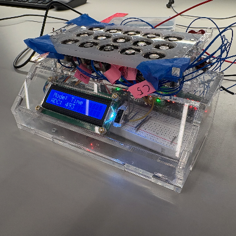

| Team Member Name | Email Address           |
| ---------------- | ----------------------- |
| Nathan Zhang     | nzha@seas.upenn.edu     |
| Ethan Murray     | eamurray@seas.upenn.edu |
| Tom Huang        | tomhuang@seas.upenn.edu |

**GitHub Repository URL:** [https://github.com/upenn-embedded/final-project-s26-t5]()

**GitHub Pages Website URL:** https://upenn-embedded.github.io/final-project-s26-t5/

### 1. Abstract

This project presents a prototype for volumetric electromagnetic control targeting optimal remediation (VECTOR) to manipulate magnetic nanoparticles (MNPs) using a 3-by-5 array of individually addressable electromagnets driven by an ATmega328PB microcontroller. The system is designed to demonstrate programmable spatial control of magnetic material through two operating modes: a time display mode, in which the current time is rendered as a magnetic pattern, and an animation mode in which input patterns are generated across the array. A Hall-effect sensing subsystem provides feedback to verify field operation, while an LCD and button interface enables real-time user interaction.

### 2. Motivation

Water contamination remains a major engineering challenge, and many conventional treatment methods can be energy-intensive, chemically harmful, or difficult to deploy in preexisting systems. Ferric-oxide MNPs are interesting as they offer a platform to functionalize polymers, which attach to contaminants and can be manipulated or recovered using magnetic fields. If such particles can be moved in a controlled manner, future systems could use them to target the collection, transport, and separation of harmful substances from water.

The recent deregulation by President Trump and Administrator Zeldin on February 12, 2026, has been considered the single largest deregulatory action in U.S. history. The Mercury and Air Toxics Standards (MATS) is a program that successfully reduced mercury emissions by 90% prior to its repeal, and its repeal has immediate, quantifiable effects on waterway pollution. Other toxins, such as arsenic and lead, whose limits have been repealed, will also plateau or reverse pollution reductions achieved since 2012. Without federal limits on harmful practices, there is an expected 23% increase in mercury emissions, with 50% stemming from the dirtiest coal plants by 2035. Toxic metals in wastewater are projected to add another 325,000 tons of pollution to rivers and streams each year, further compromising already dwindling water sources.

Functionalized MNPs are considered an implementable, highly targeted solution to this growing issue. Yet it remains limited by a fundamental technical challenge: reliably controlling magnetic materials with an electronically programmable field source. Current practices of functionalized MNPs in water discard the magnetic material, making it inefficient and costly. To create a full remediation system, a platform demonstrating repeatable magnetic actuation is necessary to verify that particles can be retained and controlled for future use in waterways. Our prototype addresses that need by building a small-scale array of electromagnets that can generate visible, programmable particle motion.

The motivation of this project is not to fully solve water remediation, but to create an experimental stepping stone toward that goal. By showing that magnetic material can be directed into specific spatial patterns and moved according to programmed sequences, this prototype helps establish the feasibility of using electronically controlled electromagnets for future nanoparticle handling in research. In later iterations, this idea could be extended to benchtop demonstrations in fluidic-controlled environments, stronger field geometries, closed-loop sensing, and ultimately to systems that move MNPs in flowing water for contaminant capture and removal.

### 3. System Block Diagram

The most critical component in our project is the array of electromagnets. These will be arranged in a 3x5 grid to demonstrate directional control. The electromagnets are powered at 5V at a max current draw of 0.22A. Thus, we anticipate a max current draw of 3.3A for 15 electromagnets. The power for these electromagnets will be supplied via a power supply, most likely from the lab bench. First, power will be routed from the power supply to an 8-channel power management IC from Adafruit that is specialized for solenoids, featuring MOSFETs with flyback diodes. We plan to use two of these and to control them with I2C from an Atmega 328PB.

For an input device, we will have a Hall effect sensor probe to ensure that the electromagnetic array is operating properly. It will communicate via a GPIO pin with the MCU.

Next, we also have a user interface. Here, the user will be able to press two buttons to demonstrate two separate modes on the electromagnetic array. The first mode will be a clock mode, in which the current time will be spelled out digit-by-digit on the array. The second mode will be an animation mode, in which the array will animate a path of moving magnetic nanoparticles. Telemetry such as the mode and whether a magnetic field was detected by the Hall effect sensor will be displayed on an LCD. We will use an I2C backpack for this LCD, which simplifies communication.

Lastly, we will use a real-time clock (RTC) chip that can tell the time even when the system is not connected to the internet. This chip will use I2C to talk to the MCU.

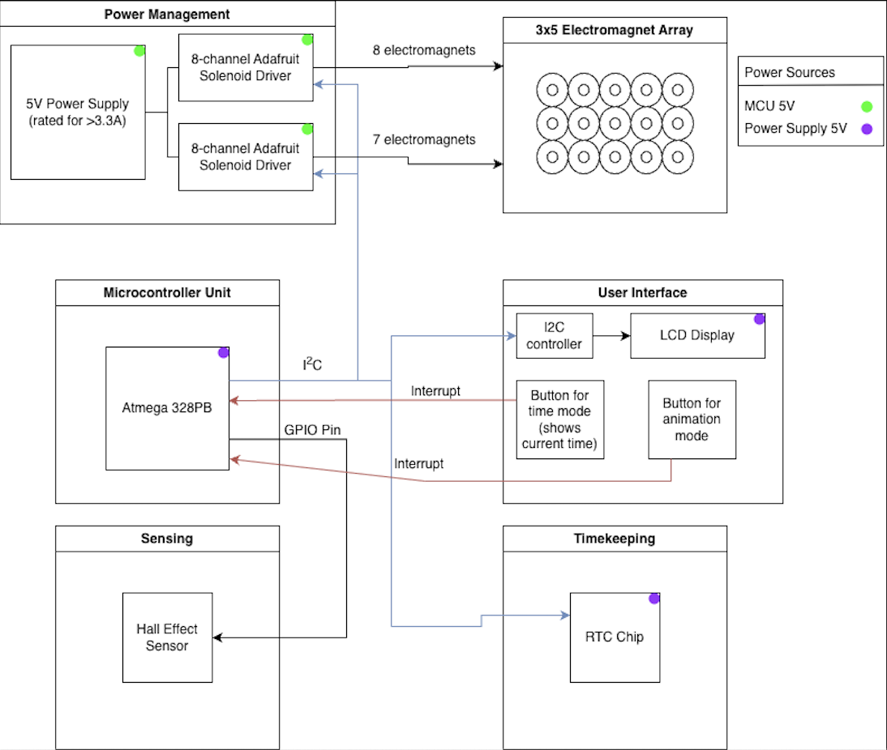

### 4. Design Sketches

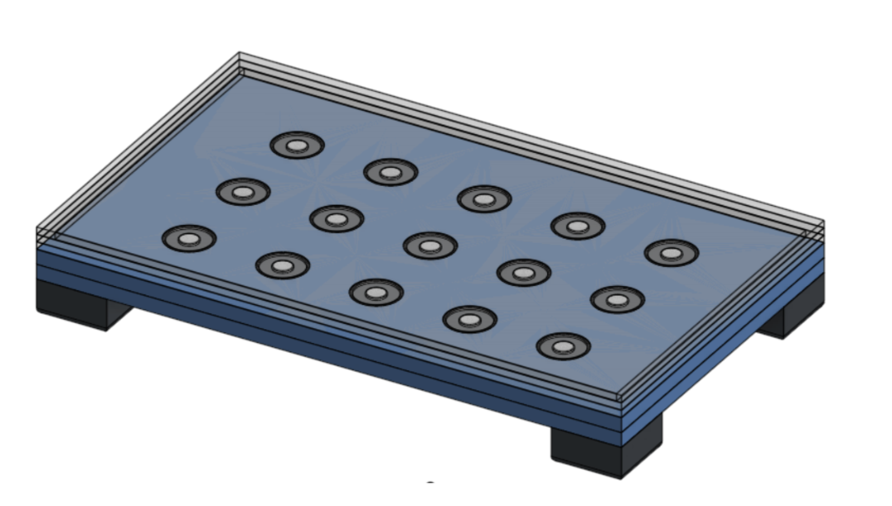

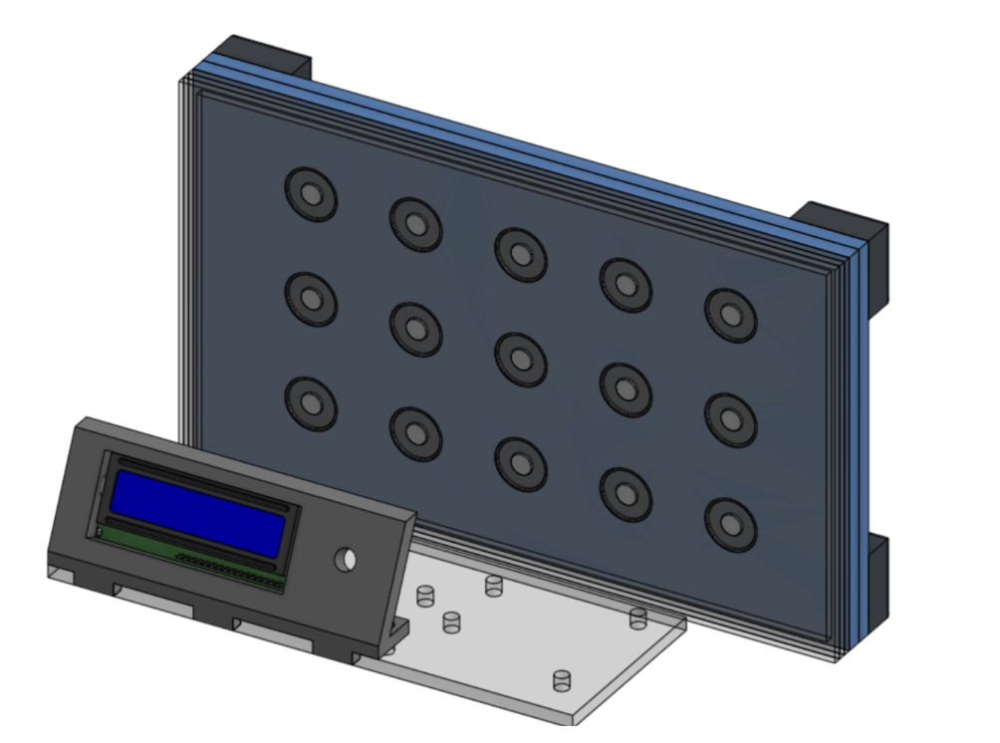

The array housing is designed with laser cutting and minimal 3D printing in mind, to offer the fastest and cleanest final product. Using acrylic will be necessary for creating a sealed environment for the suspended MNPs. Everything will be bonded with acrylic glue or screwed together using threaded inserts.

The only other intricate fabrication considerations are the MNPs themselves. Using high-temperature organic-phase thermal decomposition, which allows for high control over nucleation, size, and shape, the nanoparticles we use can be tailored to our use case. This works by slowly reacting iron oxides and other ferrites in boiling solvents with surfactants such as oleic acid. When coated with oleic acid, the hydrophobic tails prevent recombination of the introduced magnetic material, resulting in individual superparamagnetic particles. Using traditional synthesis techniques to regulate flow rate and control temperature, the size and shape of these particles can be highly tuned within nanometers. The ones used in our prototype will be spherical, with diameters on the order of 100nm, then removed from the solvent bath and suspended in the fluid chamber within our device.

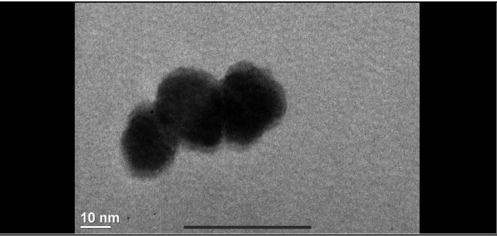

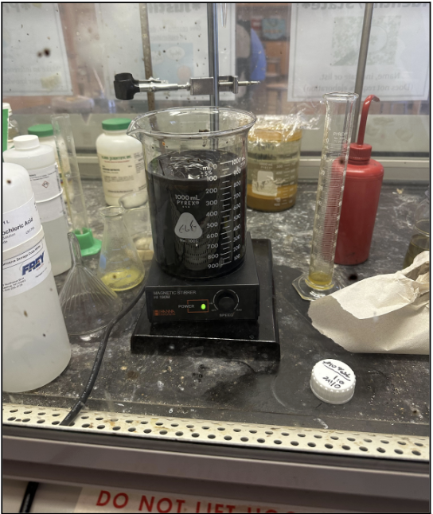

### 5. Software Requirements Specification (SRS)

**5.1 Definitions, Abbreviations**

None

**5.2 Functionality**

| ID     | Description                                                                                                                                                                                                                      |
| ------ | -------------------------------------------------------------------------------------------------------------------------------------------------------------------------------------------------------------------------------- |
| SRS-01 | The system shall communicate with the two solenoid boards through the I2C bus to independently control all 15 electromagnets in the array                                                                                        |
| SRS-02 | The system shall monitor Hall effect sensor readings to verify that the magnetic fields are present in the correct pattern when electromagnets are activated                                                                     |
| SRS-03 | The system shall read the current time from the RTC module through the I2C interface periodically                                                                                                                                |
| SRS-04 | The system shall implement a time display mode in which the microcontroller converts the current time into a pattern of electromagnets turning on that moves the magnetic field into positions that digitally represent the time |
| SRS-05 | The system shall implement an animation mode in which the ATmega328PB sequentially activates electromagnets to predefined patterns to generate an animation                                                                      |
| SRS-06 | The system shall detect button presses through hardware interrupts to switch between time display mode and animation mode                                                                                                        |

### 6. Hardware Requirements Specification (HRS)

**6.1 Definitions, Abbreviations**

MCU - Microcontroller Unit

**6.2 Functionality**

| ID     | Description                                                                                                                                                                                                              |
| ------ | ------------------------------------------------------------------------------------------------------------------------------------------------------------------------------------------------------------------------ |
| HRS-01 | The device shall include a 3x5 array of electromagnets each capable of being activated independently                                                                                                                     |
| HRS-02 | The electromagnets shall be controlled by two 8-channel solenoid driver boards that utilize MOSFETs and flyback diodes that allow high-current switching without drawing current directly from the GPIO pins of the MCU. |
| HRS-03 | The system shall use a regulated 5V power supply capable of supplying at least 3.3A to power the electromagnets, MCU, sensors and display.                                                                               |
| HRS-04 | The system shall use an ATmega328PB MCU to coordinate control of the electromagnets, sensors, display and the RTC module                                                                                                 |
| HRS-05 | The system shall include a Hall effect sensor connected to the MCU through a GPIO pin with ADC channels capable of detecting magnetic field strength generated by the electromagnet array                                |
| HRS-06 | The system shall include a real-time clock module connected to the MCU via I2C to keep accurate time keeping, checking the time once per second.                                                                         |
| HRS-07 | The system shall include two push buttons for selecting operating modes by interrupting the MCU and an LCD display connected through I2C to show the system status and current mode.                                     |

### 7. Bill of Materials (BOM)

For our materials, we first and foremost need 15 electromagnets, through which we will manipulate magnetic fields to move magnetic nanoparticles/ferrofluid. Along with these electromagnets, we will need the power management ICs to properly power and control them via the MCU. For user interaction, we will need buttons to control the operating modes of our electromagnet array and LCD with I2C-enabled control to display important information. As a test probe, we will also use a Hall effect sensor to ensure that our electromagnets are operating at expected capacities. Lastly, we will use a real-time clock chip to enable accurate tracking of the time.

**[https://docs.google.com/spreadsheets/d/1sWL6C1-NioSSsZ-AeGwEUh-nf6-uot8BXnSm6up-Bj0/edit?usp=sharing](https://docs.google.com/spreadsheets/d/1sWL6C1-NioSSsZ-AeGwEUh-nf6-uot8BXnSm6up-Bj0/edit?usp=sharing)**

### 8. Final Demo Goals

For the final demonstration, the device will be put on the table, with the electromagnetic array clearly visible. During the demo, we will feature the time display mode first by pressing the time display mode button waiting a couple of minutes to see the magnetic materials move when the minute changes to their new respective positions. Then the animation mode with the respective button as well, and the MCU will cycle through the specific shapes pre-programmed on the MCU.

### 9. Sprint Planning

| Milestone  | Functionality Achieved                                                                                                                                                                                                                                                                                 | Distribution of Work |
| ---------- | ------------------------------------------------------------------------------------------------------------------------------------------------------------------------------------------------------------------------------------------------------------------------------------------------------ | -------------------- |
| Sprint #1  | Electromagnet array assembled and validated by wiring up the 3x5 electromagnet array, connecting the solenoid driver boards, and ensuring that the magnetic material can be moved in a controllable and repeatable way without a catastrophic failure in the power supply, and that there is stability | Equal                |
| Sprint #2  | Integrate the Hall-effect sensor system and verify that the electromagnets' magnetic fields can be reliably measured by the Hall-effect sensors.                                                                                                                                                       | Equal                |
| MVP Demo   | Make the user interface system by wiring the LCD display, mode-selecting buttons, and the RTC chip, and then writing the software.                                                                                                                                                                     | Equal                |
| Final Demo | Fully fucntional magnetic field control prototype                                                                                                                                                                                                                                                      | Equal                |

**This is the end of the Project Proposal section. The remaining sections will be filled out based on the milestone schedule.**

## Sprint Review #1

### Last week's progress

We designed and fabricated the enclosures for the MNP reservoir and magnetic array. Then we stress-tested the magnets with similar specs to see if they could apply a great enough field to manipulate the particles in the reservoir. When faced with issues, we considered adding a plate to the next version of the device to improve the field strength. We worked on programming the peripherals in C and creating a separate design to hold the electronics.

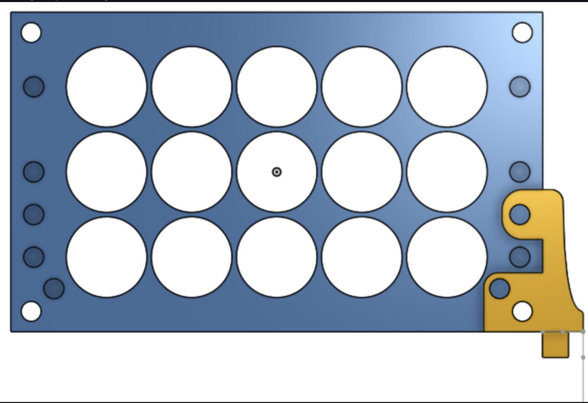

| col1 | col2 | col3 |
| ---- | ---- | ---- |
|      |      |      |
|      |      |      |

### Current state of project

Initialized I2C communication to interface with an RTC chip and LCD screen. Configured the ADC converter to convert values from the Hall effect sensor. Set up external hardware interrupts for two push buttons to toggle the system between time display mode and magnetic drawing mode. This code is attached in the github as Final_project.c

### Next week's plan

The primary plan for next week is to finalize the hardware code and ensure it’s fully functional. Once that is verified and we assemble our array, we will (ensuring the reservoir is waterproof) begin running trials on control over the array and ferrofluid.

## Sprint Review #2

### Last week's progress

We redesigned the enclosure so that the electromagnets can be screwed in using threaded inserts rather than press-fitted, since press fitting resulted in an uneven surface. The parts for the driver boards and sensors arrived, and we began working on the I2C interface to communicate with the Adafruit solenoid driver boards from the ATmega328PB. We also acquired iron filings and ferrofluid as a fallback in case the magnetic nanoparticle plan doesn't work out.

### Current state of project

The electromagnet array enclosure has been revised and is being reassembled with the new screw-in mounting approach. I2C communication with the solenoid driver boards is in development. We have magnetic materials on hand (iron filings/ferrofluid) ready for testing once the driver interface is functional. The Hall-effect sensor integration is underway to verify that the electromagnets produce detectable fields at the expected positions in the array.

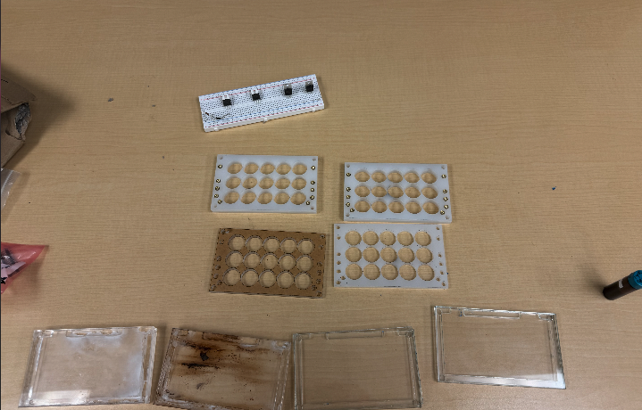

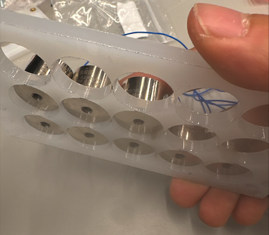

### Next week's plan

Complete and validate the I2C driver interface so all 15 electromagnets can be individually controlled. Finish integrating the Hall-effect sensor and confirm reliable magnetic field readings. Begin wiring and programming the user interface components — the LCD display (via I2C backpack), the two mode-select buttons, and the RTC module — to prepare for the MVP demo.

## MVP Demo

https://docs.google.com/presentation/d/1lgXZZuJsAKx94grMAz8MiSn8iH7MAbFuXWXLTbPirKE/edit?usp=sharing

^MVP Demo Presentation

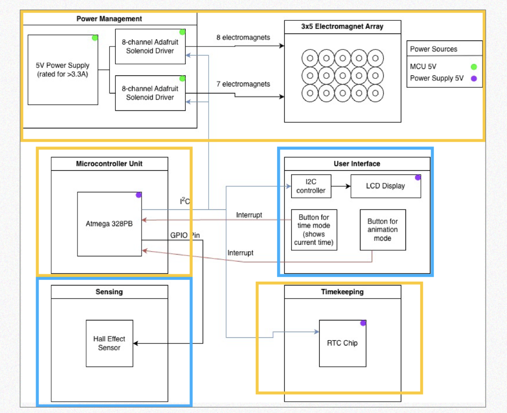

1. So far we have implemented the Atmega with the power management system with the two solenoid drivers that power the 15 electromagents (3x5) array. Right now, we have a petri-dish of ferrofluid that we can move across the array, and we programmed it so it turns on the magnets sequentially row by row. We also built a separate system with the ATmega and the peripherals with the LCD display and the buttons that toggle between time mode and animation mode, as well as taking in analog readings from the Hall effect sensor and displaying them on the LCD.
2. Our firmware centers on the ATmega328PB, which manages the system’s two main modes: time display and animation. In time mode, the microcontroller reads the current time from the RTC over I²C, and should convert it into the corresponding activation pattern for the 3×5 electromagnet array (we have yet to do this), and updates the display; in animation mode, it instead steps through predefined electromagnet sequences to generate motion (we have yet to do this). The firmware also reads the hall-effect sensor, updates the LCD with status information, and uses button-triggered interrupts to switch modes quickly and reliably. The most important drivers we wrote were the I²C driver for communication with the RTC and solenoid-control hardware, the RTC driver for register-level time reads and writes, the button interrupt logic for mode changes.

   4. We have achieved all of our software requirement specifications except one: The system displaying the time obtained by the RTC chip through the ferrofluid controlled by the electromagnets. For all the other software specification requirements, we were able to see it working, for example, the time and mode being displayed on the LCD display.
   5. We have achieved all of our hardware requirement specifications.

   6 &7.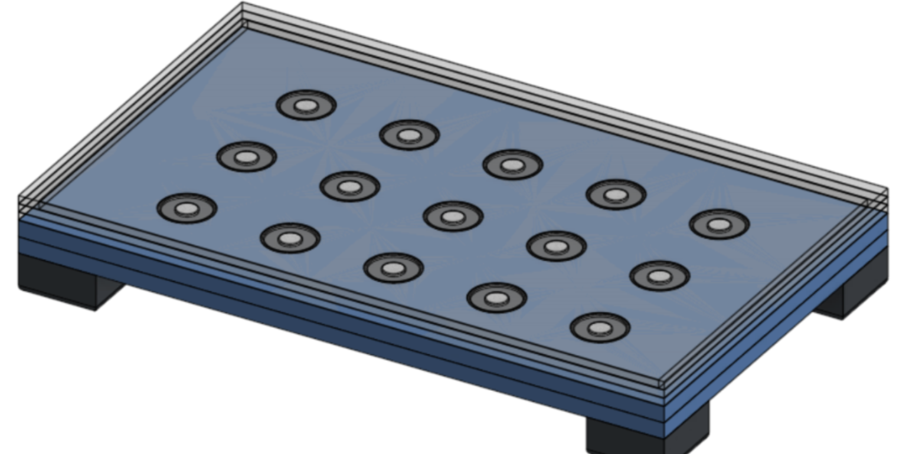

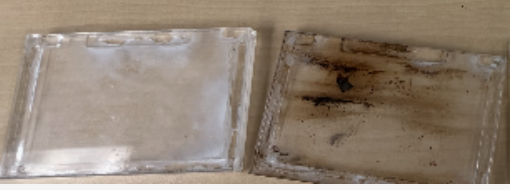

Right now, we are still just using a petri dish to hold the ferro fluid that we put on top of the magnets. We tried making an acryllic container to put the ferrofluid on top of, but it stained the acrylic glass, so now we are looking for other options. That would be what I would say is the most riskiest part of the project. We also have to make the caseing for all the electronics, to place the led display and buttons and to put the breadboard and everything, to make the project look nice and functional.

8. No questions for the teaching team.

## Final Report

Don't forget to make the GitHub pages public website!
If you’ve never made a GitHub pages website before, you can follow this webpage (though, substitute your final project repository for the GitHub username one in the quickstart guide):  [https://docs.github.com/en/pages/quickstart](https://docs.github.com/en/pages/quickstart)

### 1. Video

### 2. Images

|  |  |  |
| ---------------------------------------------- | ---------------------------------------------- | ---------------------------------------------- |
|  |  |  |
|  |  |  |
|  |  |  |
|  |  |                                                |

### 3. Results

## References

## 3.1 Software Requirements Specification (SRS) Results

| ID     | Description                                                                                                                                                                                                                       | Validation Outcome                                                                                                                                                                                                                                                                    |
| ------ | --------------------------------------------------------------------------------------------------------------------------------------------------------------------------------------------------------------------------------- | ------------------------------------------------------------------------------------------------------------------------------------------------------------------------------------------------------------------------------------------------------------------------------------- |
| SRS-01 | The system shall communicate with the two solenoid boards through the I2C bus to independently control all 15 electromagnets in the array.                                                                                        | Confirmed. The ATmega328PB communicated with the solenoid driver boards over I2C, and the final prototype activated the electromagnets in the 3x5 array through the two driver boards. Video show the driver boards powered and the electromagnet array controlling the ferrofluid. . |
| SRS-02 | The system shall monitor Hall effect sensor readings to verify that the magnetic fields are present in the correct pattern when electromagnets are activated.                                                                     | Confirmed. The Hall effect sensor was read through the MCU ADC, and the LCD displayed the measured value during operation. The validation image shows the LCD reading “ADC: 472,” confirming live Hall sensor monitoring.                                                           |
| SRS-03 | The system shall read the current time from the RTC module through the I2C interface periodically.                                                                                                                                | Confirmed. The RTC module was connected through I2C and the firmware was able to read time data periodically. Time displayed in time mode through the ferrofluid.                                                                                                                     |
| SRS-04 | The system shall implement a time display mode in which the microcontroller converts the current time into a pattern of electromagnets turning on that moves the magnetic field into positions that digitally represent the time. | Confirmed. The system implemented the time mode interface and could read the current time from the RTC, the final conversion of the RTC time into a ferrofluid/electromagnet time pattern was fully completed.                                                                       |
| SRS-05 | The system shall implement an animation mode in which the ATmega328PB sequentially activates electromagnets to predefined patterns to generate an animation.                                                                      | Confirmed. The system demonstrated a draw/animation mode where electromagnets were sequentially activated in programmed patterns. The final demo setup showed the array connected and operating through the solenoid driver boards.                                                   |
| SRS-06 | The system shall detect button presses through hardware interrupts to switch between time display mode and animation mode.                                                                                                        | Confirmed. The two buttons were implemented as mode-select inputs using hardware interrupts.                                                                                                                                                                                         |

## 3.2 Hardware Requirements Specification (HRS) Results

| ID     | Description                                                                                                                                                                                                              | Validation Outcome                                                                                                                                                                                                                                    |
| ------ | ------------------------------------------------------------------------------------------------------------------------------------------------------------------------------------------------------------------------ | ----------------------------------------------------------------------------------------------------------------------------------------------------------------------------------------------------------------------------------------------------- |
| HRS-01 | The device shall include a 3x5 array of electromagnets each capable of being activated independently.                                                                                                                    | Confirmed. The final build includes a 3x5 array of 15 electromagnets mounted in the acrylic housing. The wiring and demo images show the full array connected to the driver boards for independent activation.                                        |
| HRS-02 | The electromagnets shall be controlled by two 8-channel solenoid driver boards that utilize MOSFETs and flyback diodes that allow high-current switching without drawing current directly from the GPIO pins of the MCU. | Confirmed. The prototype uses two 8-channel solenoid driver boards to control the 15 electromagnets. Images show the boards connected between the ATmega328PB and the electromagnet array, preventing the MCU from directly supplying magnet current. |
| HRS-03 | The system shall use a regulated 5V power supply capable of supplying at least 3.3A to power the electromagnets, MCU, sensors and display.                                                                               | Confirmed. The full system operated with the electromagnets, MCU, Hall sensor, RTC module, buttons, and LCD powered simultaneously, validating that the regulated 5V supply was sufficient for operation.                                             |
| HRS-04 | The system shall use an ATmega328PB MCU to coordinate control of the electromagnets, sensors, display and the RTC module.                                                                                                | Confirmed. The ATmega328PB coordinated electromagnet control, Hall sensor ADC readings, LCD updates, RTC timekeeping, and button interrupt handling in the final prototype.                                                                           |
| HRS-05 | The system shall include a Hall effect sensor connected to the MCU through a GPIO pin with ADC channels capable of detecting magnetic field strength generated by the electromagnet array.                               | Confirmed. The Hall effect sensor was connected to an MCU ADC channel and produced live readings on the LCD. The displayed “ADC: 472” value verifies that the sensor hardware was functioning during testing.                                       |
| HRS-06 | The system shall include a real-time clock module connected to the MCU via I2C to keep accurate time keeping, checking the time once per second.                                                                         | Confirmed. The RTC module was integrated over I2C and used by the firmware for timekeeping. The timekeeping subsystem worked alongside the LCD and mode-control firmware.                                                                             |
| HRS-07 | The system shall include two push buttons for selecting operating modes by interrupting the MCU and an LCD display connected through I2C to show the system status and current mode.                                     | Confirmed. The final prototype included two mode-select buttons and an I2C LCD display. The LCD displayed both operating mode and sensor status, including “Mode: Draw” and the ADC reading.                                                        |
